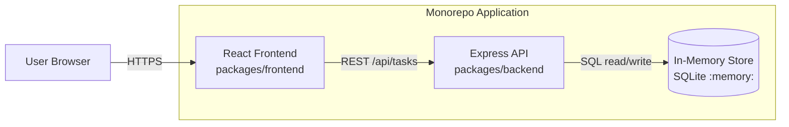

# Cloud Architecture Overview

## System Context



  ## Sequence: Create a TODO

  ```mermaid
  sequenceDiagram
    actor U as User
    participant FE as React Frontend
    participant API as Express API
    participant DB as In-Memory SQLite

    U->>FE: Enter title and click Add Task
    FE->>FE: Validate required title
    FE->>API: POST /api/tasks { title, description, due_date }
    API->>API: Validate payload
    API->>DB: INSERT task row
    DB-->>API: Insert result (task id)
    API->>DB: SELECT inserted task
    DB-->>API: New task record
    API-->>FE: 201 Created + task JSON
    FE->>API: GET /api/tasks
    API->>DB: SELECT tasks ORDER BY due_date, created_at
    DB-->>API: Task list
    API-->>FE: 200 OK + tasks JSON
    FE-->>U: Render updated task list
  ```
